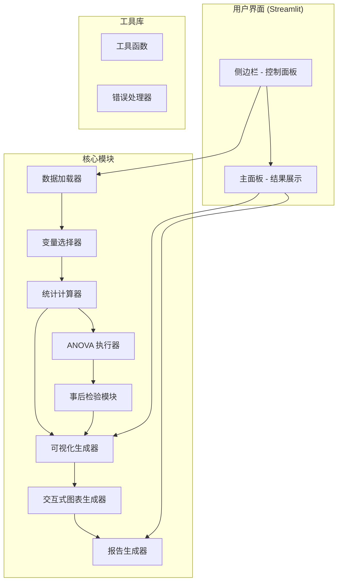

# Streamlit ANOVA 与可视化工具 - 架构设计

## 项目概述
构建一个基于浏览器的自动化方差分析 (ANOVA) 与可视化工具，支持单因素、多因素 ANOVA、Welch's ANOVA、Kruskal-Wallis 检验，并提供丰富的可视化与交互功能。

## 技术栈
- **前端/UI**: Streamlit
- **数据处理**: Pandas, NumPy
- **统计分析**: SciPy, Statsmodels, Pingouin (推荐用于简便的 ANOVA 和事后检验)
- **可视化**: Matplotlib, Seaborn, Statannotations (用于在图中添加显著性标注)
- **交互式图表**: Plotly 或 Altair (可选)
- **报告导出**: ReportLab (PDF), CSV

## 架构设计

### 组件图


### 模块职责

1. **数据加载器 (data_loader.py)**
   - 支持 CSV、Excel 文件上传
   - 自动检测列类型和缺失值
   - 返回 Pandas DataFrame

2. **变量选择器 (variable_selector.py)**
   - 提供分组变量（自变量）下拉选择
   - 提供检测变量（因变量）多选
   - 支持多因素 ANOVA 的多个分组变量选择

3. **统计计算器 (stats_calculator.py)**
   - 描述性统计（均值、标准差、中位数等）
   - 正态性检验（Shapiro-Wilk）
   - 方差齐性检验（Levene）
   - 返回检验结果和决策

4. **ANOVA 执行器 (anova_executor.py)**
   - 根据前提检验结果选择适当模型：
     - 正态且方差齐：Standard One-way ANOVA
     - 方差不齐：Welch's ANOVA
     - 非正态：Kruskal-Wallis 检验
   - 支持多因素 ANOVA（双因素）
   - 返回 ANOVA 表（F值、P值、显著性）

5. **事后检验模块 (posthoc.py)**
   - Tukey HSD（方差齐）
   - Games-Howell（方差不齐）
   - Dunn's test（非参数）
   - 返回两两比较结果和显著性矩阵

6. **可视化生成器 (visualizer.py)**
   - 箱线图（Seaborn）
   - 小提琴图（带显著性标注）
   - 带散点的柱状图（均值 ± 标准差）
   - 集成 statannotations 自动标注显著性

7. **交互式图表生成器 (interactive_visualizer.py)**
   - Plotly 交互式箱线图/小提琴图
   - Altair 可视化（可选）
   - 支持缩放、悬停查看数值

8. **报告生成器 (report_generator.py)**
   - 导出统计结果为 CSV
   - 生成 PDF 报告（含图表和结果）
   - 支持自定义报告模板

9. **主应用 (app.py)**
   - Streamlit 界面布局
   - 侧边栏控制面板
   - 主结果显示区域
   - 按钮事件处理和流程协调

10. **工具函数 (utils.py)**
    - 中文显示配置（Matplotlib 字体设置）
    - 数据清洗函数
    - 错误处理装饰器

### 数据流
1. 用户上传数据文件
2. 系统加载数据并显示列名
3. 用户选择分组变量和检测变量
4. 点击“方差分析”按钮：
   - 执行描述性统计
   - 执行前提假设检验
   - 根据检验结果选择 ANOVA 模型
   - 执行 ANOVA 和事后检验
   - 显示统计结果
5. 用户点击可视化按钮：
   - 生成相应图表
   - 显示在下方区域
6. 用户可下载图表或导出报告

### 文件结构
```
anova_app/
├── app.py                      # 主 Streamlit 应用
├── requirements.txt            # 依赖包列表
├── modules/
│   ├── data_loader.py
│   ├── variable_selector.py
│   ├── stats_calculator.py
│   ├── anova_executor.py
│   ├── posthoc.py
│   ├── visualizer.py
│   ├── interactive_visualizer.py
│   ├── report_generator.py
│   └── utils.py
├── static/                     # 静态资源（字体等）
├── templates/                  # 报告模板
└── tests/                      # 单元测试
```

### 界面布局
**侧边栏**：
- 文件上传器
- 变量选择区域
- 操作按钮：[方差分析]、[生成箱线图]、[生成小提琴图]、[生成带散点的柱状图]、[导出报告]

**主面板**：
- 上方：统计结果区域（可展开/折叠）
  - 描述性统计表
  - 假设检验结果
  - ANOVA 表
  - 事后比较结果
- 下方：可视化区域
  - 图表显示
  - 图表控制（尺寸调整、下载按钮）
  - 交互式图表切换

### 错误处理
- 空文件上传警告
- 非数值列检测
- 分组变量水平少于2个的警告
- 缺失值处理提示
- 内存限制提示（大型数据集）

## 后续扩展
1. 支持重复测量 ANOVA
2. 协方差分析 (ANCOVA)
3. 多变量 ANOVA (MANOVA)
4. 效应量计算 (η², ω²)
5. 统计功效分析
6. 自动化报告生成（Word 格式）
7. 云端部署（Streamlit Sharing, Hugging Face Spaces）

---
*设计完成时间: 2026-03-27*